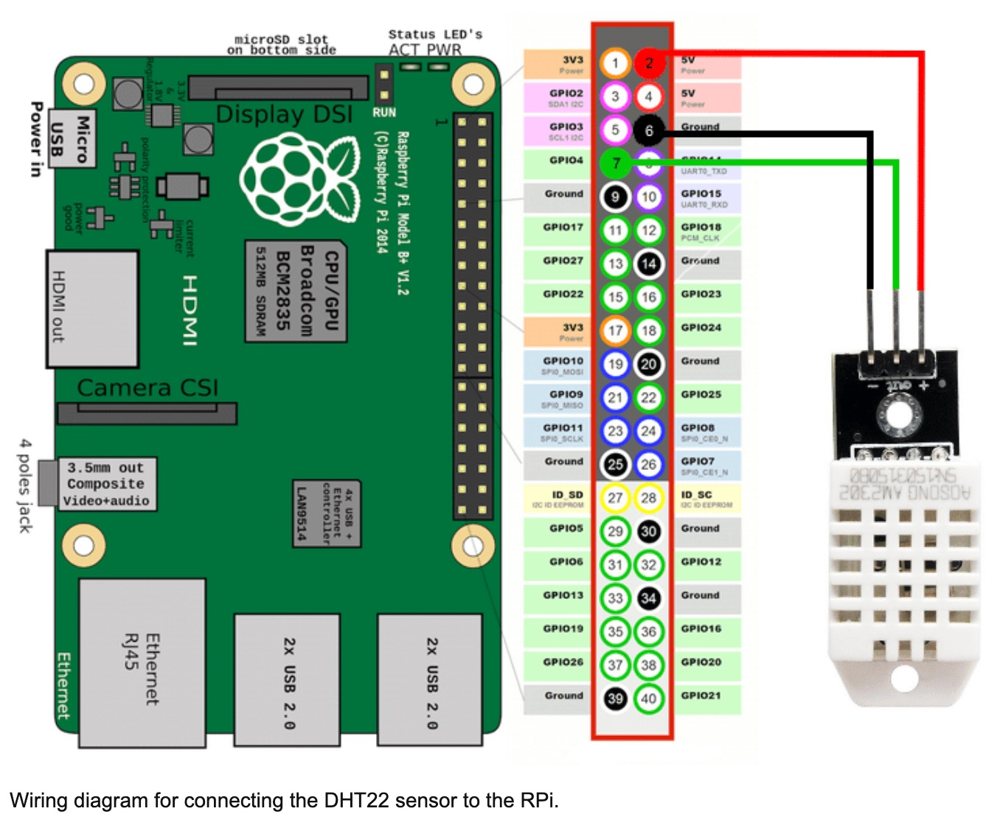

# Sensor-Project

Web app to display current temperature and humidity of the room with Raspberry Pi and a temperature sensor

## Setup

Connect the sensor according to following diagram


### Install project dependencies 

Install sqlite and its dependencies in RaspberryPi

```
sudo apt update
sudo apt full-upgrade
# Install sqlite globally as installing from npm doesn't work
sudo apt install sqlite3
# In order for sqlite3 installation to work we need libsqlite3 installed locally as mentioned in the docs
# https://github.com/TryGhost/node-sqlite3#source-install
sudo apt-get install libsqlite3-dev
npm install sqlite3 --build-from-source --sqlite=/usr/
```

Install the rest of the project dependencie
```
cd server
npm install
```

Optional:
Install pm2 to run the app in the background
```
sudo npm install -g pm2
```

Run the app
```
node server/index.js
```

Notes:

To fix .gitignore issue:
https://stackoverflow.com/questions/32401387/git-add-adding-ignored-files/32545286

Basically when I created .gitignore file with 'echo "node_modules" >> .gitignore' in PowerShell on Windows, the file have been created with a different encoding then UTF-8. After changing the encoding for .gitignore on NotePad++ the issue was fixed and on VSCode the ignoring folder was recognised.  
